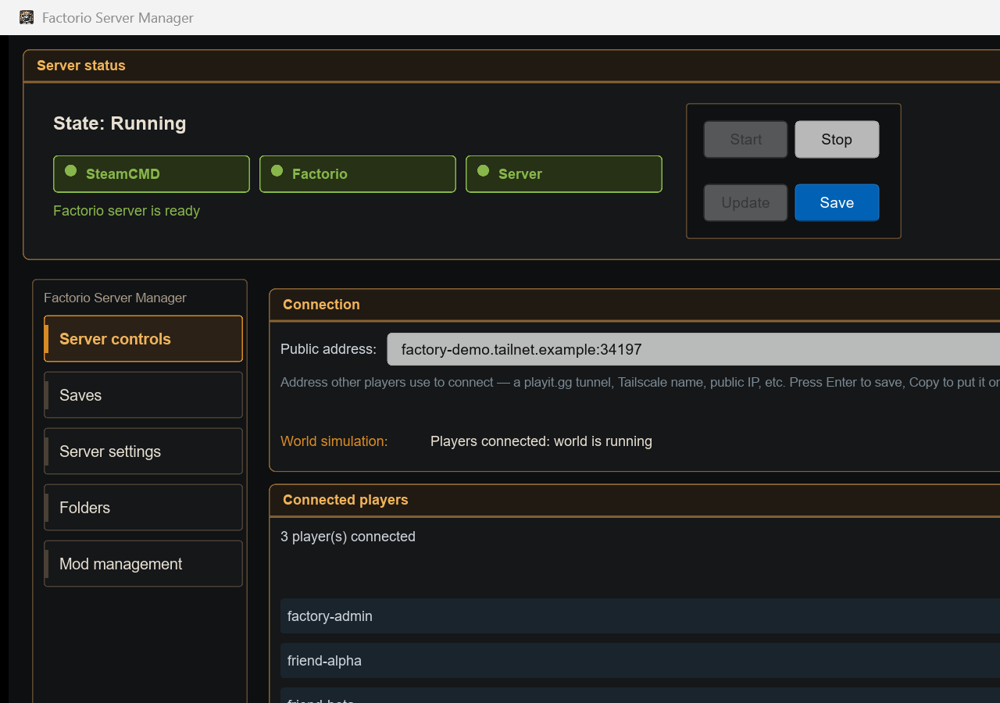
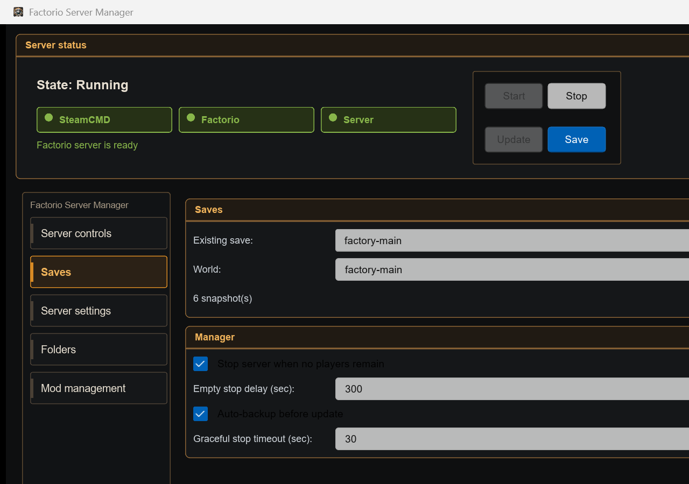
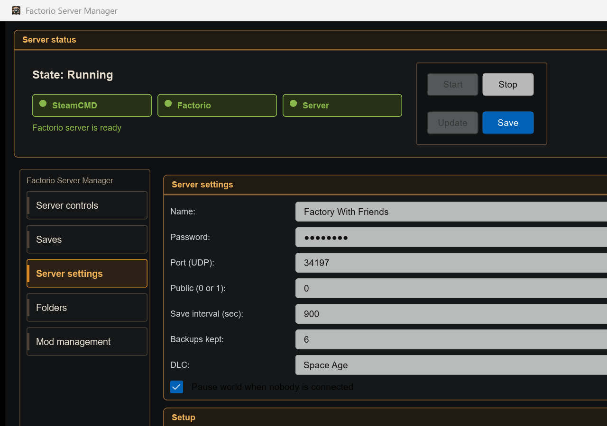
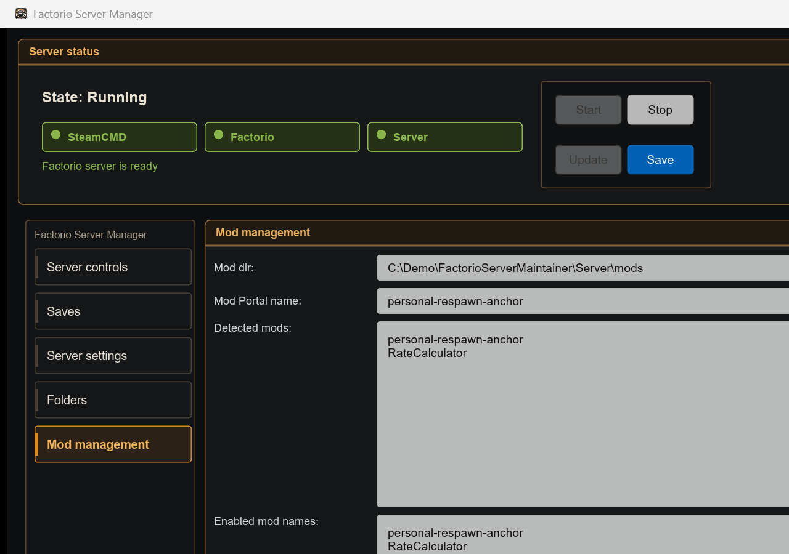

# Factorio Server Maintainer User Guide

[日本語ガイド](user-guide.ja.md)

This is a Windows-first GUI for managing one Factorio dedicated server.
For normal use, you should not need to edit `config.toml` by hand.

The screenshots below are from the real app running with anonymized demo data.

## 1. Open the App

Normal flow for non-developers:

1. Download the latest `factorio-server-maintainer-*-windows-x64.zip` from
   [GitHub Releases](https://github.com/soyukke/factorio-server-maintainer/releases)
2. Extract it into a writable folder  
   Example: `%USERPROFILE%\Apps\FactorioServerMaintainer`
3. Run `factorio-server-manager.exe`
4. On first launch, press `Save` to create the app config
5. Press `Update` to install SteamCMD and the Factorio server
6. Press `Start`

When using the release zip, you do not need Rust, `just`, `mise`, or `just setup`.

Developer flow from source:

```powershell
just setup
```

Open the GUI:

```powershell
just run
```

`just setup` is idempotent. Running it again reuses existing files and prepares
only the missing pieces.

## 2. Server Controls



The Server controls screen shows server status, the shareable address, connected
players, and recent network information.

- `Start`: start the server
- `Stop`: ask Factorio to save, then stop the server
- `Update`: update the Factorio server through SteamCMD
- `Save`: save the settings shown in the GUI
- `Public address`: save and copy a Tailscale name, playit.gg address, or public IP for friends

The player and network sections are based on Factorio logs plus the diagnostics
that Tailscale exposes. This is not a direct per-player in-game ping API from
the Factorio server.

## 3. Saves and Backups



The Saves screen is where you switch saves, enter a new world name, and configure
backup-related manager behavior.

To play an existing save:

1. Stop the server
2. Pick the save from `Existing save`
3. Press `Select`
4. Save settings if needed, then start the server

To start a new world:

1. Stop the server
2. Enter a new name in `World`
3. Press `Select` or `Save`
4. The next server start creates the new save zip automatically

When `Stop server after the last player leaves` is enabled, the manager waits
for the configured delay and then performs a graceful stop. If someone comes
back before the delay expires, the stop is cancelled.

## 4. DLC Mode



DLC mode is selected in the GUI, not by manually editing TOML.

Use the `DLC` dropdown on the Server settings screen:

- `Base`: Factorio base game only
- `Space Age`: enables the built-in Space Age mod set

When `Space Age` is selected and saved, the manager writes the managed mod list
with these built-in mods enabled:

- `elevated-rails`
- `quality`
- `space-age`

Stop the server, save the setting, and restart the server for the change to
take effect.

This screen also controls the server name, password, UDP port, autosave interval,
number of backups kept, and Factorio's official `auto_pause` option.

## 5. Mod Management



The Mod management screen can add mods by Mod Portal name.

Example:

```text
personal-respawn-anchor
```

Typical flow:

1. Enter the mod name in `Mod Portal name`
2. Press `Add`
3. Confirm it appears in `Enabled mod names`
4. Save settings and restart the server

If you already have a mod zip, use `Add zip`.

Gameplay mods are not server-only. Players joining the server need the same mod
set in their Factorio client. Factorio prompts clients to synchronize mods when
they connect.

### Personal Respawn Anchor

`personal-respawn-anchor` is a small multiplayer mod that stores respawn anchors
per player and per planet/surface.

- Mod Portal: <https://mods.factorio.com/mod/personal-respawn-anchor>
- Source: <https://github.com/soyukke/personal-respawn-anchor>

Do not run it at the same time as the older `respawn-beacon` mod, because the
respawn behavior can become confusing.

## 6. Folders

The Folders screen lets you change where SteamCMD, the Factorio server, saves,
backups, and logs are stored.

The default locations stay under the current Windows user:

```text
%USERPROFILE%\.factorio-server-maintainer\
%USERPROFILE%\.game-server-backups\factorio\
```

Steam passwords and Factorio service tokens are not stored in this manager's
config file.

## 7. Development Checks

```powershell
just precommit
```

This runs:

- gitleaks
- `cargo fmt --all --check`
- `cargo clippy --workspace --all-targets -- -D warnings -D clippy::too_many_lines`
- `cargo test --workspace`
