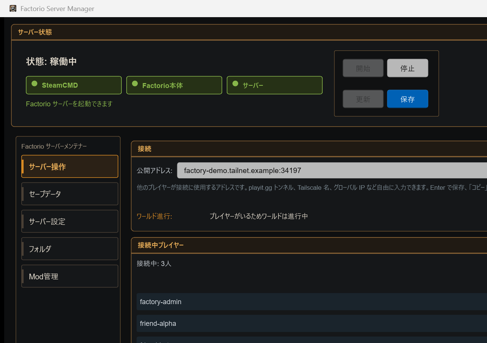
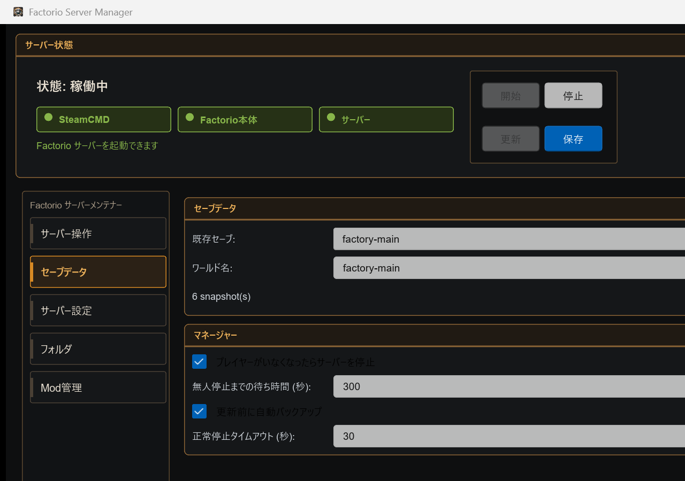
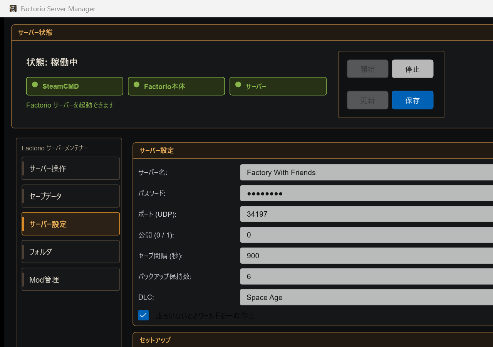
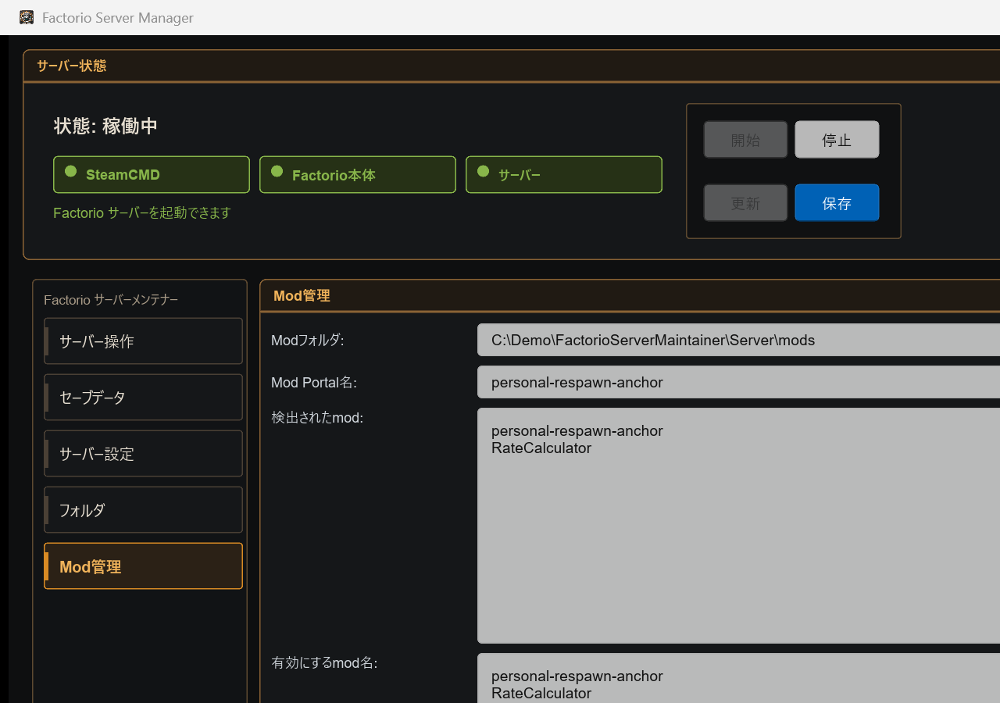

# Factorio Server Maintainer ユーザーガイド

[English guide](user-guide.en.md)

このツールは、Factorio 専用サーバーを GUI から管理するための Windows 向けアプリです。
通常操作では `config.toml` を手で編集する必要はありません。

スクリーンショットは実際のアプリを README 用の匿名デモデータで起動して撮影したものです。

## 1. 起動する

初回セットアップ:

```powershell
just setup
```

アプリを開く:

```powershell
just run
```

`just setup` は何度実行しても大丈夫です。足りないものだけを準備します。

## 2. サーバー操作



「サーバー操作」画面では、サーバーの状態、共有アドレス、接続中プレイヤー、ネットワーク状態を確認できます。

- `開始`: サーバーを起動します
- `停止`: Factorio に保存させてからサーバーを止めます
- `更新`: Factorio server を SteamCMD で更新します
- `保存`: GUI 上の設定を保存します
- `公開アドレス`: Tailscale 名、playit.gg、グローバルIPなど、友達に渡す接続先を保存・コピーします

表示されるプレイヤー数とネットワーク欄は、Factorio のログと Tailscale から取れる範囲の診断です。
ゲーム内の個人別 ping を Factorio server から直接取得する機能ではありません。

## 3. セーブデータとバックアップ



「セーブデータ」画面では、既存セーブの切り替え、新しいワールド名の指定、バックアップ関連の設定を行います。

既存セーブで遊ぶ:

1. サーバーを停止します
2. `既存セーブ` から遊びたいセーブを選びます
3. `選択` を押します
4. 必要なら `保存` を押して、サーバーを起動します

新しいワールドで始める:

1. サーバーを停止します
2. `ワールド名` に新しい名前を入力します
3. `選択` または `保存` を押します
4. 次回起動時に、その名前のセーブ zip が自動作成されます

`プレイヤーがいなくなったらサーバーを停止` を有効にすると、最後のプレイヤーが抜けてから指定秒数後に正常停止します。
停止前に誰かが戻ってきた場合は止まりません。

## 4. DLC モード



DLC は `config.toml` ではなく、GUI の「サーバー設定」画面で選びます。

`DLC` のプルダウンで選べる項目:

- `Base`: Factorio 本体のみ
- `Space Age`: Space Age 用の組み込み mod を有効化

`Space Age` を選んで保存すると、管理対象の mod 設定に次の組み込み mod が反映されます。

- `elevated-rails`
- `quality`
- `space-age`

変更を反映するには、サーバーを停止してから保存し、再起動してください。

この画面ではほかに、サーバー名、パスワード、UDPポート、autosave間隔、バックアップ保持数、公式 `auto_pause` も設定できます。

## 5. Mod 管理



「Mod管理」画面では、Mod Portal 名を入力して mod を追加できます。

例:

```text
personal-respawn-anchor
```

使い方:

1. `Mod Portal名` に mod 名を入力します
2. `追加` を押します
3. `有効にするmod名` に入っていることを確認します
4. 保存して、サーバーを再起動します

zip を手元に持っている場合は `zip追加` から追加できます。

Gameplay mod はサーバーだけでは完結しません。参加者の Factorio クライアントにも同じ mod セットが必要です。
Factorio は接続時に mod 同期を促します。

### Personal Respawn Anchor

`personal-respawn-anchor` は、プレイヤーごと・惑星ごとに復活アンカーを持てる自作 mod です。

- Mod Portal: <https://mods.factorio.com/mod/personal-respawn-anchor>
- Source: <https://github.com/soyukke/personal-respawn-anchor>

古い `respawn-beacon` と同時に有効化すると挙動が混ざるため、どちらか片方だけを使ってください。

## 6. フォルダ設定

「フォルダ」画面では、SteamCMD、Factorio server、セーブ、バックアップ、ログの保存先を変更できます。

既定では安全にユーザーディレクトリ配下を使います。

```text
%USERPROFILE%\.factorio-server-maintainer\
%USERPROFILE%\.game-server-backups\factorio\
```

公開リポジトリに入れてはいけない Steam パスワードや Factorio service token は、このツールの設定ファイルには保存しません。

## 7. 開発者向けチェック

```powershell
just precommit
```

実行内容:

- gitleaks
- `cargo fmt --all --check`
- `cargo clippy --workspace --all-targets -- -D warnings -D clippy::too_many_lines`
- `cargo test --workspace`
